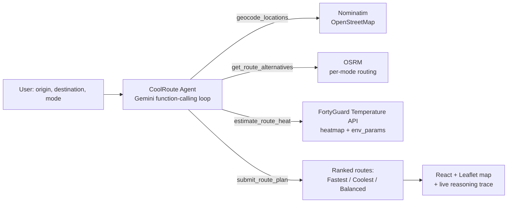

# 🌡️ FortyGuard CoolRoute

**A Google-Maps-style route planner that ranks routes by measured heat exposure, not just travel time.**

Built for **FortyGuard Hackathon'26 — Track 6 (Agentic Track)**. Give it an origin, a destination,
and a travel mode (walking, cycling, or driving), and a single autonomous agent geocodes both
ends, pulls real street-level route alternatives, measures real temperature and solar-irradiance
data along every candidate route, and recommends which one to actually take — labeling the
options **Fastest**, **Coolest**, and **Balanced** the way Google Maps labels its own alternatives.

It's aimed at people for whom "fastest" isn't the only thing that matters in the heat: delivery
drivers and couriers, people walking or biking to work, and anyone planning to be outside for a
while.

## Why this matters

Two routes with the same air temperature can feel completely different if one runs through
continuous direct sun and the other stays mostly shaded. Published heat-routing research (ASU
Cool Routes, CoolWalks, CoolPaths, HEAL) backs this up: sun exposure varies far more than air
temperature within a route. CoolRoute measures **both** — mean/max temperature and mean solar
irradiance — along the actual corridor of each candidate route, and its recommendation explains
the real trade-off in plain language (e.g. *"2 minutes slower but 3.1°C cooler with less direct
sun, avoids full sun on 7th Ave"*).

## How it works



1. **Geocode** — both addresses resolved via Nominatim (free, keyless OpenStreetMap search).
2. **Route** — real street-level alternatives fetched from OSRM, using the correct per-mode
   profile (walking ≈ 4.5 km/h, cycling ≈ 14.5 km/h, driving ≈ 55 km/h — not one profile
   pretending to be all three).
3. **Measure** — each route's path is buffered into a thin corridor polygon and sent to
   FortyGuard's `create_heatmap` endpoint for temperature, plus three sampled points along the
   route to `env_params` for solar irradiance (direct sun exposure).
4. **Decide** — the agent weighs both signals, labels the real alternatives it was given (never
   inventing a route), and returns a structured plan with a concrete measured outcome, a risk
   category + safety tip per route, and the FortyGuard/OSRM call IDs it used as sources.
5. **Show the work** — every tool call and result streams live to the UI as an auditable trace,
   not just a final answer.

Optionally, the agent can also compare a handful of departure times on the same day (e.g. 9am vs
noon vs 3pm vs 6pm) and highlight the coolest time to leave.

## Tech stack

| Layer | Choice |
|---|---|
| Agent reasoning | Google Gemini (`google-genai`, function-calling loop, single `AgentRunner` engine) |
| Backend | Python, FastAPI, `httpx`, SSE streaming (`sse-starlette`) |
| Routing | OSRM (openstreetmap.de per-mode demo servers) |
| Geocoding | Nominatim (OpenStreetMap) |
| Heat data | [FortyGuard Temperature API](https://www.fortyguard.com) (`create_heatmap`, `env_params`) |
| Frontend | React 19 + TypeScript, Vite, Tailwind CSS, React-Leaflet |
| Persistence | SQLite (agent run/event history + response cache) |

## Project structure

```
backend/
  app/
    agents/         AgentRunner engine + the CoolRoute agent (system prompt, tools)
    fortyguard/      FortyGuard API client, validation, caching, demo-mode fixtures
    routing/         OSRM + Nominatim client, route-corridor geometry helpers
    routes/          FastAPI routers (coolroute run/replay, health)
    storage/         SQLite schema + repositories
  tests/             pytest suite (geometry, validation, agent logic -- no network calls)
frontend/
  src/
    components/      map, route-plan view, trace timeline, UI kit
    hooks/           SSE agent-stream hook, usage/credits hook
    lib/             typed API client, SSE parser, shared types
    pages/           the single CoolRoute page
render.yaml          Render Blueprint (deploys both services together)
```

## Running locally

**Requirements:** Python 3.12+, Node 20+, a [FortyGuard API key](https://www.fortyguard.com) and
a [Gemini API key](https://ai.google.dev/) (both free to obtain).

### Backend

```bash
cd backend
python -m venv .venv && .venv\Scripts\activate   # or `source .venv/bin/activate` on macOS/Linux
pip install -r requirements.txt
copy .env.example .env    # or `cp` on macOS/Linux -- then fill in your API keys
uvicorn app.main:app --reload
```

Runs on `http://127.0.0.1:8000`. Leave `DEMO_MODE=true` in `.env` to run entirely on bundled
fixtures (zero FortyGuard credits spent, no key required for that endpoint) while developing the
UI; flip it to `false` once your FortyGuard key is in place.

### Frontend

```bash
cd frontend
npm install
npm run dev
```

Runs on `http://localhost:5173` and proxies `/api/*` to the backend automatically in dev — no
extra configuration needed locally.

### Tests

```bash
cd backend
pytest
```

26 tests covering route-corridor geometry, heat-risk categorization, and FortyGuard's
US-bounds/date-range/area-cap validation rules — no live network calls.

## Deploying to Render

This repo includes a [`render.yaml`](render.yaml) Blueprint that deploys the backend (Python web
service) and frontend (static site) together as two linked services.

1. Push this repo to GitHub.
2. In the [Render dashboard](https://dashboard.render.com), click **New → Blueprint** and point
   it at your GitHub repo. Render will read `render.yaml` and propose both services.
3. Before deploying, set the two secret env vars on the **coolroute-api** service (Render will
   prompt for these since they're marked `sync: false` in the blueprint):
   - `FORTYGUARD_API_KEY`
   - `GEMINI_API_KEY`
4. Deploy. Render builds and starts both services; the static site is pre-configured to call the
   API service's URL via `VITE_API_BASE_URL`, and the API service's `CORS_ORIGINS` is
   pre-configured to allow the static site's origin.

**If the default service names (`coolroute-api`, `coolroute-app`) are already taken on Render**,
pick different ones when creating the blueprint, then update two values to match: the API
service's `CORS_ORIGINS` env var, and the static site's `VITE_API_BASE_URL` env var — both need
to point at each other's actual `*.onrender.com` URL.

**Manual setup (without the blueprint)** works the same way: create a Python web service rooted
at `backend/` with build command `pip install -r requirements.txt` and start command
`uvicorn app.main:app --host 0.0.0.0 --port $PORT`, and a static site rooted at `frontend/` with
build command `npm install && npm run build` and publish directory `dist`. Set the env vars from
`backend/.env.example` and `frontend/.env.example` on the respective services.

Render's free-tier web services spin down after inactivity, so the first request after idle can
take up to ~30s to cold-start.

## FortyGuard endpoints used

- `POST /v1/create_heatmap` (`analytic_type=tcm`) — measured temperature statistics over each
  route's corridor polygon.
- `POST /v1/env_params` — point-level temperature, heat index, AQI, and solar irradiance, sampled
  at a few points along each route.
- `POST /v1/system/fetch-api-key-usage` — shown in the UI as a live demo-mode/live-mode +
  remaining-credits badge.

**Data constraints (enforced client-side before any call is made):** U.S. locations only; dates
from 2021-01-01 through today; heatmap requests additionally allow forecasting up to **12 hours**
ahead of the current time (no longer-range forecast is available); area-of-interest polygons are
capped at ~130 km² (route corridors auto-shrink their width to stay under this for long routes).

## Disclosure

Agent reasoning and tool orchestration are powered by **Google Gemini** (`gemini-flash-lite-latest`
by default) via the `google-genai` SDK, using a manual function-calling loop (not a third-party
agent framework) so every tool call and result can be persisted and streamed live to the UI as an
auditable trace.
